记录一些前沿文献


[Graph Augmentation](#Graph-Augmentation)

+ [Data Augmentation for Graph Neural Networks   AAAI 2021](#Data-Augmentation-for-Graph-Neural-Networks---AAAI-2021)
+ [Graph-Revised Convolutional Network   arXive 2020](#Graph-Revised-Convolutional-Network)
+ [NodeAug: Semi-Supervised Node Classification with Data Augmentation   KDD2020](#NodeAug-Semi-Supervised-Node-Classification-with-Data-Augmentation)


[Graph Generation](#Graph-Generation)

- [Identifying critical edges in complex networks     Scientific Rrports 2018](#Identifying-critical-edges-in-complex-networks)


[Graph Equivariant](#Graph-Equivariant)

- [Natural Graph Networks    NIPS 2020](#Natural-Graph-Networks)
- [Invariant and Equivariant Graph Networks    ICLR 2019](#Invariant-and-Equivariant-Graph-Networks)
- [E(n) Equivariant Graph Neural Networks   arXive 2021](#E(n)-Equivariant-Graph-Neural-Networks)


[Graph Attack](#Graph Attack)

- [Towards More Practical Adversarial Attacks on Graph Neural Networks    NIPS 2020](#Towards-More-Practical-Adversarial-Attacks-on-Graph-Neural-Networks)


[Recommender Systems](#Recommender-Systems)

- [Factorization Machines    2010 IEEE ICDM](#Factorization-Machines)
- [DeepFM: A Factorization-Machine based Neural Network for CTR Prediction    IJCAI2017](#DeepFM)


# Graph Augmentation


###  [Data Augmentation for Graph Neural Networks   AAAI 2021](https://arxiv.org/abs/2010.04740)

[原文](papers/Data-Augmentation-for-Graph-Neural-Networks.pdf)

[代码链接](https://github.com/zhao-tong/GAug)

图增强，主要研究增减边对图数据的影响

Specifically, we discuss how facilitating message passing by removing “noisy” edges and adding “missing” edges that could exist in the original graph can benefit GNN performance, and its relation to intra-class and inter-class edges.

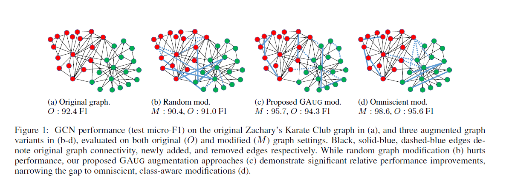

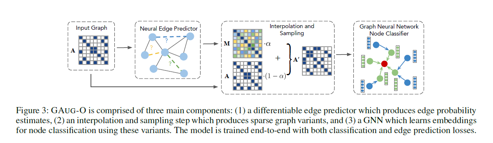


效果：

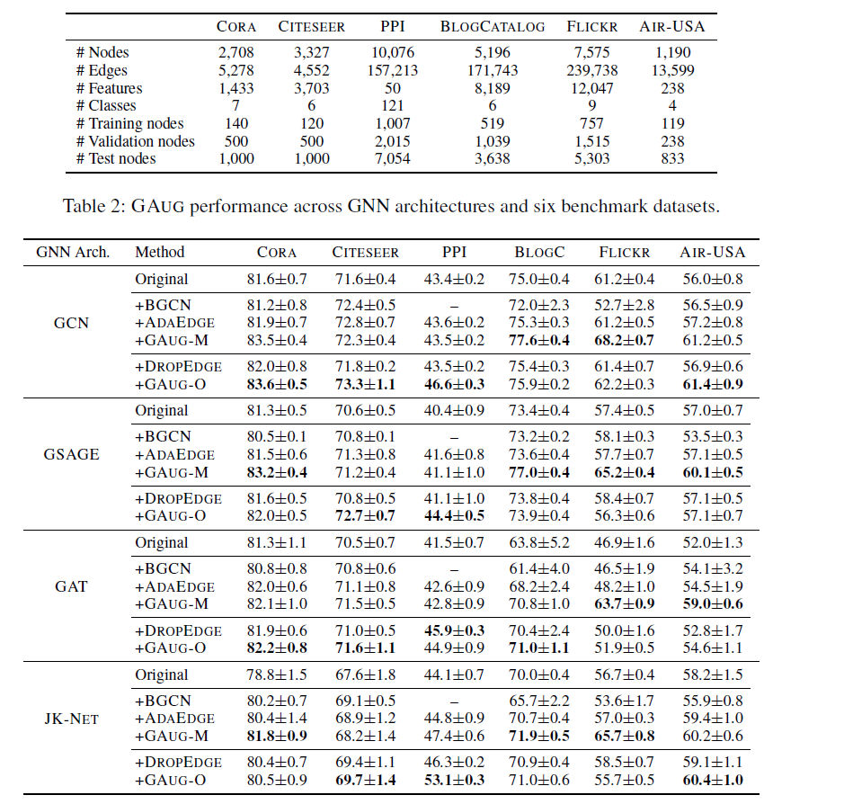


### [Graph-Revised Convolutional Network](https://arxiv.org/abs/1911.07123)


[原文](papers/Graph-Revised-Convolutional-Network.pdf)

[代码](https://github.com/Maysir/GRCN)

使用一個gcn作爲圖修正模快，一個gcn作爲圖分類模塊，

對於adj預測，在密集图上进行了Knearest-neighbour（KNN）稀疏化处理：对于每个节点，我们将边缘保留为top-K预测分数。  KNN稀疏图的邻接矩阵，表示为S（K），

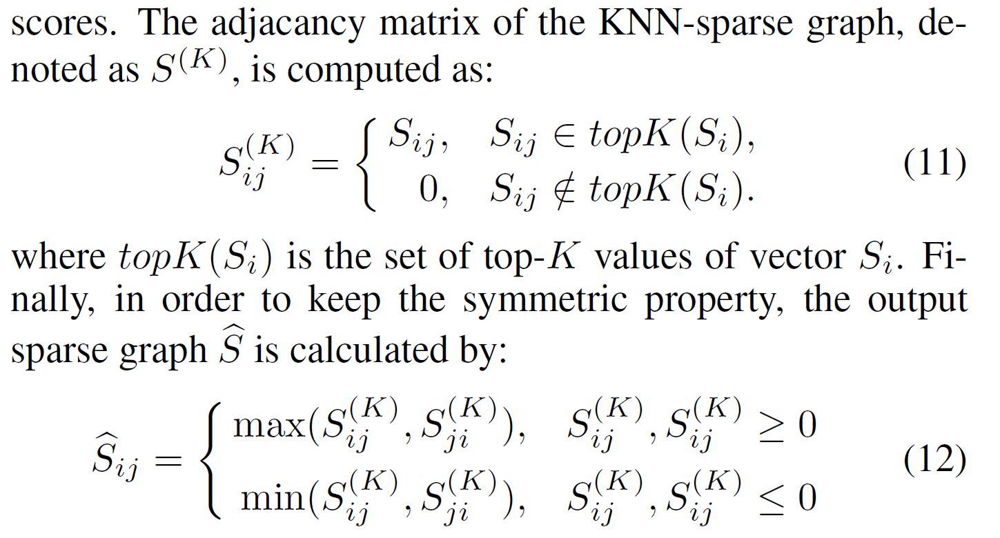


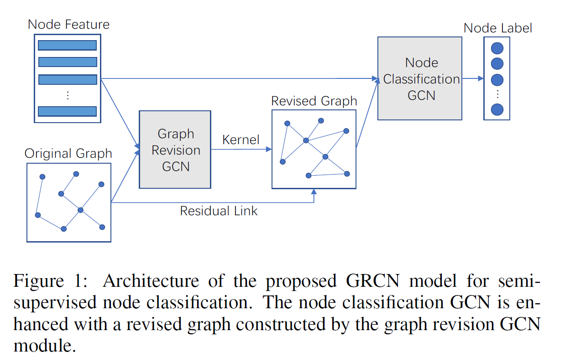


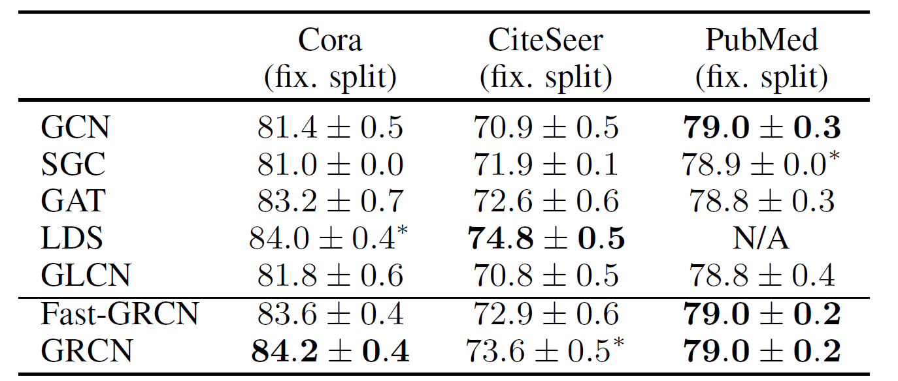


### [NodeAug Semi-Supervised Node Classification with Data Augmentation](https://bhooi.github.io/papers/nodeaug_kdd20.pdf)

[原文](papers/NodeAug.pdf)

暂无代码


[整体结构](#整体结构)

[主要机制](#主要机制)

[对比实验](#对比效果)


#### **整体结构**

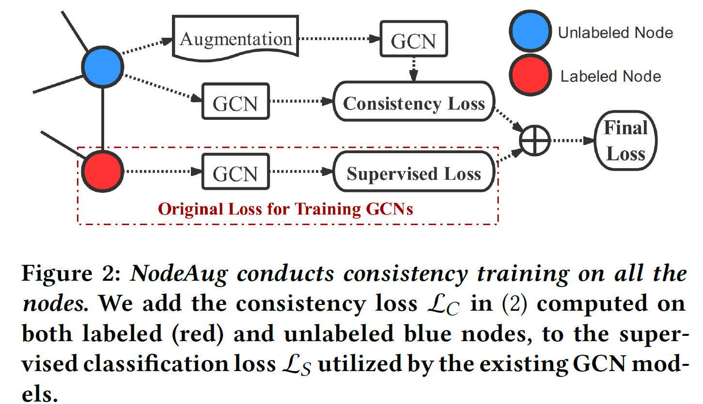


以节点为中心划分为三层（2-hop），子里向外分别为level 1 ~ level 3,级别由高到低，即 level 1 higerer than level 2

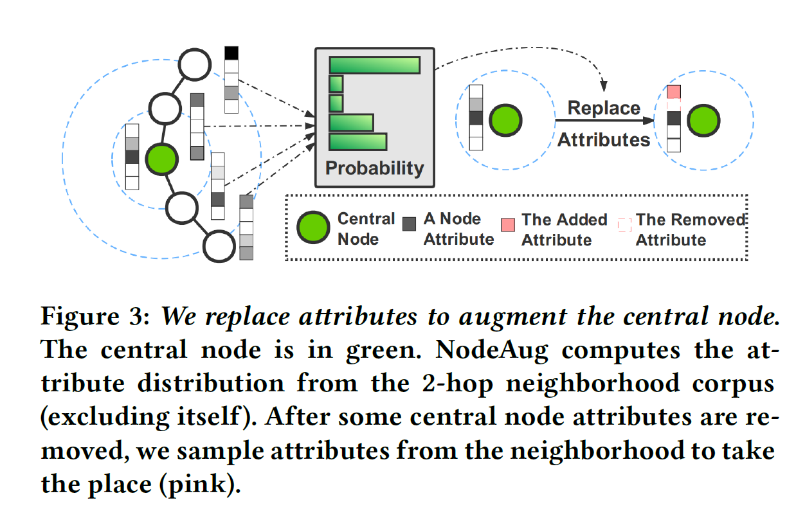


#### **主要机制**

- [replacing attributes](#replacing-attributes)
- [removing edges](#removing-edges)
- [adding edges](#adding-edges)
- [subgraph mini-batch training](#subgraph-mini-batch-training)

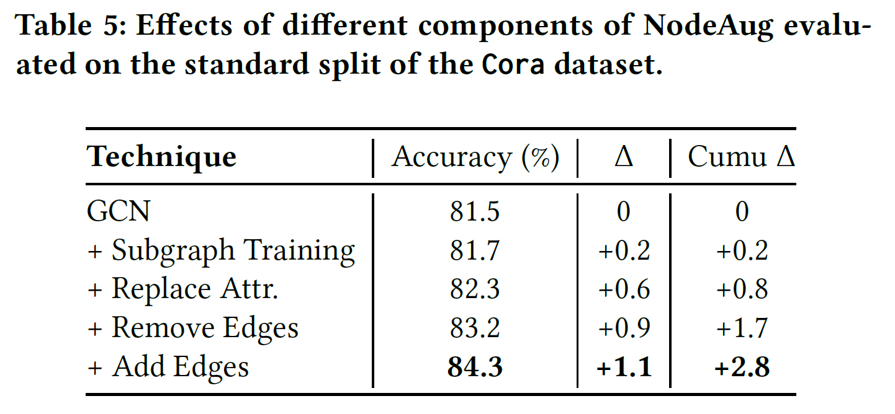

##### **replacing attributes**


##### **removing edges**

去边时，目的是保留重要的边，去除不重要的边

具有更大**度**的节点倾向于更具影响力。例如，社交网络中的名人往往有很多追随者。

Suppose the degree of the node on its lower end is $𝑑_{𝑙𝑜𝑤}$. We define the score of an edge as:
$$
s_e = log(d_{low})     \qquad (7) 
$$


Suppose the maximum and average edge scores on level 𝑙 are $𝑠 ^{(𝑙)} _{𝑒−max}$ and $𝑠 ^{(𝑙)} _{𝑒−avg}$ respectively.

The probability of removing the edge with score 𝑠𝑒 on level 𝑙 to:
$$
𝑝_{𝑒−𝑟𝑒𝑚} = min \left(
 
𝑝𝑙
\frac{𝑠^{(𝑙 )}
_{𝑒−max} − 𝑠_𝑒}
{𝑠 ^{(𝑙)} _{𝑒−max} - 𝑠 ^{(𝑙)} _{𝑒−avg}}
, 1

\right )

\qquad (8)
$$
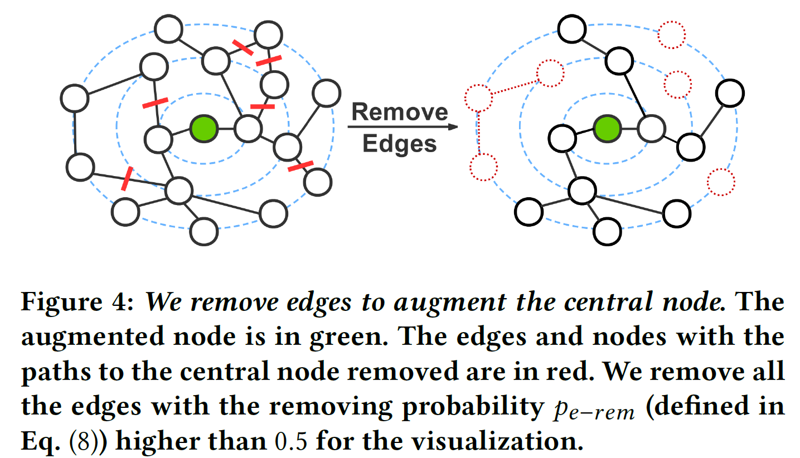


##### adding edges

在**中心节点**与**2级和3级的某些节点**之间添加边，例如，在引文网络中，论文 A 引用 B，因为它使用 B 中引入的方法 M。然而，M不是B的主要贡献，B引用的论文C提出了M。 然后，在 A 和 C 之间添加边，在不更改其标签的情况下增强 A 的输入要素。
$$
𝑝_{𝑒−add} = min \left(
 
\frac{𝑝}{𝑙}
\frac{
𝑠_n - 𝑠^{(𝑙 )}_{n−min} }
{𝑠 ^{(𝑙)} _{n−ave} - 𝑠 ^{(𝑙)} _{n−min}}
, 1

\right )

\qquad (8)
$$


与图像中增广方法对比：

removing —— cutting

adding —— shearing and resizing, 改变卷积顺序


##### subgraph mini-batch training


#### 实验结果


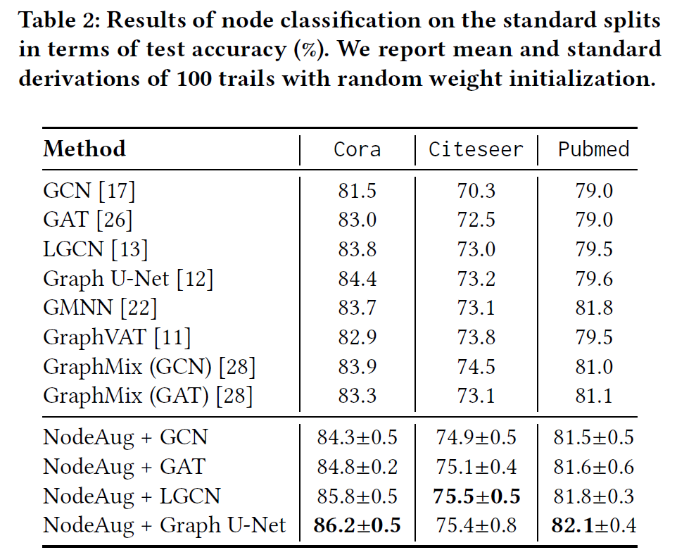


# Graph Generation


### 补充知识

- Graph center / Jordan Center


- Eigenvector centrality

In [graph theory](https://en.wikipedia.org/wiki/Graph_theory), **eigenvector centrality** (also called **eigencentrality** or **prestige score[[1\]](https://en.wikipedia.org/wiki/Eigenvector_centrality#cite_note-:0-1)**) is a measure of the influence of a [node](https://en.wikipedia.org/wiki/Node_(networking)) in a [network](https://en.wikipedia.org/wiki/Network_(mathematics)). Relative scores are assigned to all nodes in the network based on the concept that connections to high-scoring nodes contribute more to the score of the node in question than equal connections to low-scoring nodes. A high eigenvector score means that a node is connected to many nodes who themselves have high scores.[[2\]](https://en.wikipedia.org/wiki/Eigenvector_centrality#cite_note-2) [[3\]](https://en.wikipedia.org/wiki/Eigenvector_centrality#cite_note-3)

 The eigenvector centrality thesis reads:

> A node is important if it is linked to by other important nodes.

- **Math**

  Let $A = (a_{i,j})$ be the adjacency matrix of a graph. The eigenvector centrality $x_{i}$ of node $i$ is given by: $$x_i = \frac{1}{\lambda} \sum_k a_{k,i} \, x_k$$ where $\lambda \neq 0$ is a constant. In matrix form we have: $$\lambda x = x A$$

  

  Hence the centrality vector $x$ is the **left-hand eigenvector** of the adjacency matrix $A$ associated with the eigenvalue $\lambda$. It is wise to **choose $\lambda$ as the largest eigenvalue in absolute value of matrix $A$.** By virtue of Perron-Frobenius theorem, this choice guarantees the following desirable property: if matrix $A$ is irreducible, or equivalently if the graph is (strongly) connected, then the eigenvector solution $x$ is both unique and positive.

  

  The **power method** can be used to solve the eigenvector centrality problem. Let $m(v)$ denote the signed component of maximal magnitude of vector $v$. If there is more than one maximal component, let $m(v)$ be the first one. For instance, $m(-3,3,2) = -3$. Let $x^{(0)}$ be an arbitrary vector. For $k \geq 1$:

  1. repeatedly compute $x^{(k)} = x^{(k-1)} A$;
  2. normalize $x^{(k)} = x^{(k)} / m(x^{(k)})$;

  until the desired precision is achieved. It follows that $x^{(k)}$ converges to the dominant eigenvector of $A$ and $m(x^{(k)})$ converges to the dominant eigenvalue of $A$. If matrix $A$ is sparse, each vector-matrix product can be performed in linear time in the size of the graph.

  The method converges when the dominant (largest) and the sub-dominant (second largest) eigenvalues of $A$, respectively denoted by $\lambda_1$ and $\lambda_2$, are separated, that is they are different in absolute value, hence when $|\lambda_1| > |\lambda_2|$. The rate of convergence is the rate at which $(\lambda_2 / \lambda_1)^k$ goes to $0$. Hence, if the sub-dominant eigenvalue is small compared to the dominant one, then the method quickly converges.

  **x向量即所有Node的大小，该向量值代表个node的得分，并根据最大的得分归一化**

- **Code**

  The built-in function evcent ([R](http://igraph.org/r/doc/evcent.html), [C](http://igraph.org/c/doc/igraph-Structural.html#igraph_eigenvector_centrality)) computes eigenvector centrality.

  A user-defined function eigenvector.centrality follows:

  ```
  # Eigenvector centrality (direct method)
  #INPUT
  # g = graph
  # t = precision
  # OUTPUT
  # A list with:
  # vector = centrality vector
  # value = eigenvalue
  # iter = number of iterations
  
  eigenvector.centrality = function(g, t) {
    A = get.adjacency(g);
    n = vcount(g);
    x0 = rep(0, n);
    x1 = rep(1/n, n);
    eps = 1/10^t;
    iter = 0;
    while (sum(abs(x0 - x1)) > eps) {
      x0 = x1;
      x1 = as.vector(x1 %*% A);
      m = x1[which.max(abs(x1))];
      x1 = x1 / m;
      iter = iter + 1;
    } 
    return(list(vector = x1, value = m, iter = iter))
  }  
  ```


### **Identifying critical edges in complex networks**

[原文](papers/Identifying-critical-edges-in-complex-networks.pdf)

#### 摘要

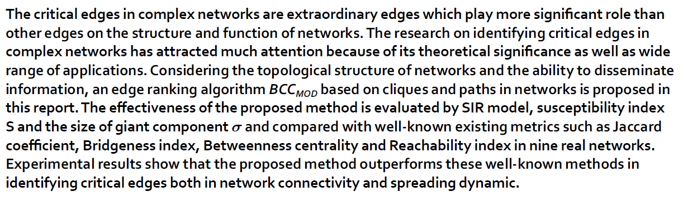


# Graph Equivariant


### Natural Graph Networks

[原文](papers/Natural-Graph-Networks.pdf)

代码暂无


### Invariant and Equivariant Graph Networks

[原文](papers/Invariant-and-equivariant-graph.pdf)


### **E(n) Equivariant Graph Neural Networks**

[原文](papers/E(n)-Equivariant-Graph-Neural-Networks.pdf)


#### 摘要

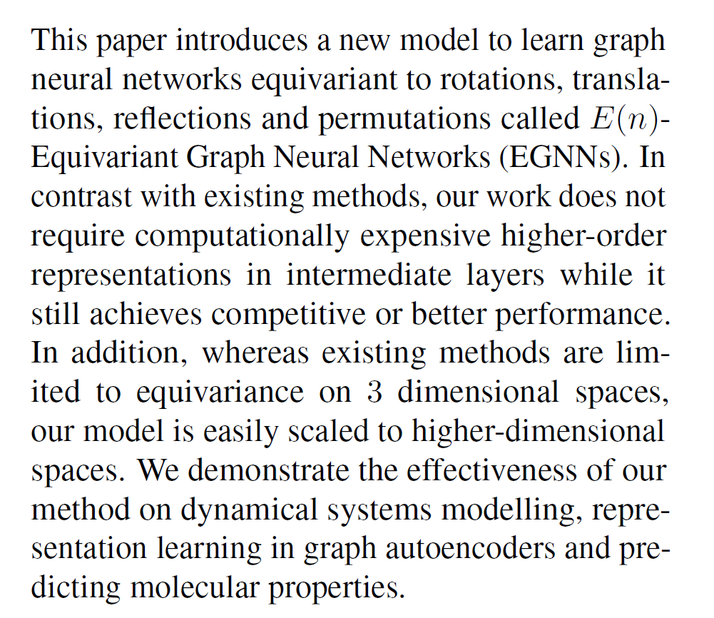


# Graph Attack


### 背景知识

- ##### **对抗攻击**（针对节点分类问题）

  攻击分类：

  - **Happen Time**

    During model Training   ——   **poisoning**(中毒)

    During model Testing     ——   **evasion**(逃避)

  - **Aim**

    Mislead the prediction on specific nodes ——    **targeted attack**

    Damage the overall task performance 	 ——    **untargeted attack**

  - **Attacker’s knowledge aobut the model**

    **white-box attacks** —— full information（model parameters, input data, labels）

    **grey-box attacks**—— partial information（the exact setups vary in a range）

    **black-box**—— input data and sometimes the black-box predictions of the model

    

- ##### **Inductive Bias (归纳偏置)**

  > 机器学习算法在学习过程中对某种假设（hypothesis）的偏好，称为“归纳偏好”（inductive bias），或简称为“偏好”

  例如对一组数据进行拟合的曲线有无数种，其中有的比较“简单”（假设我们认为曲线更平滑意味着“更简单”），有的更复杂。例如一组可以用二次曲线来拟合的数据点，用更复杂的更高阶的曲线也可以拟合，那我们的模型应该选择哪条曲线/假设呢？这就是模型对假设的偏好问题。

  > 所谓的inductive bias，指的是人类对世界的**先验知识**，对应在网络中就是**网络结构**。

  归纳偏差有点像我们所说的先验（Prior），但是有点不同的是归纳偏差在学习的过程中不会更新，但是先验在学习后会不断地被更新。


### Towards More Practical Adversarial Attacks on Graph Neural Networks

[原文](papers/Towards-More-Practical-Adversarial-Attacks-on-Graph-Neural-Networks.pdf)

[代码](https://github.com/Mark12Ding/GNN-Practical-Attack)

#### **摘要**

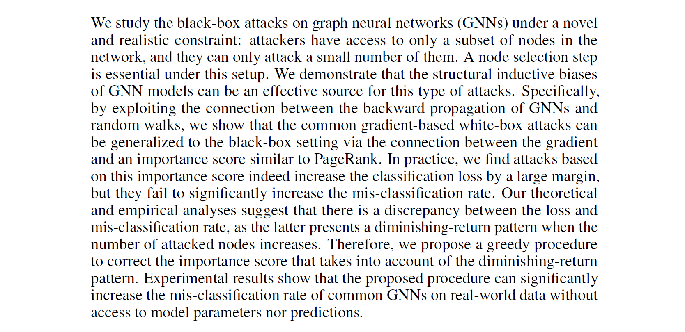

#### 整体结构

**GC-RWCS** (Greedily Corrected RWCS) strategy

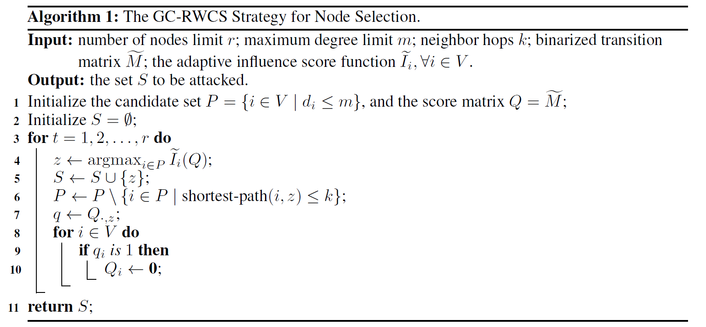


#### 主要机制

- [local constraint on node access](#local-constraint-on-node-access)
- 

利用下试代替loss的该变量，由白盒变为黑盒，使不包含y label
$$
\tilde \delta ^i =C\sum _{j=1} ^N (M^L )_{ji}
$$
小扰动，使用一阶泰勒展开近似


##### local constraint on node access


#### 实验结果

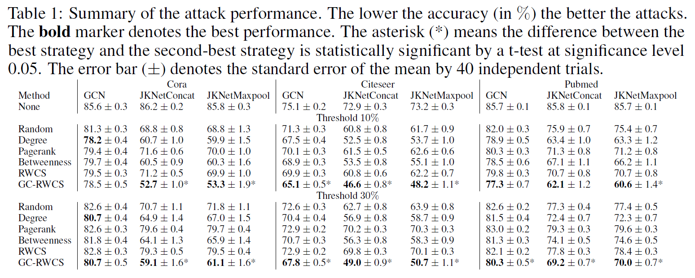


**实验设置：**

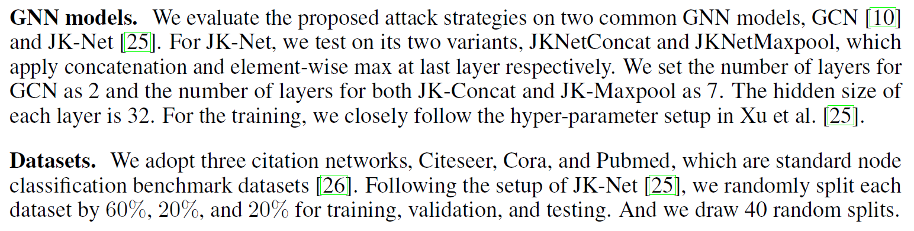


# Recommender Systems


### Factorization Machines


### DeepFM